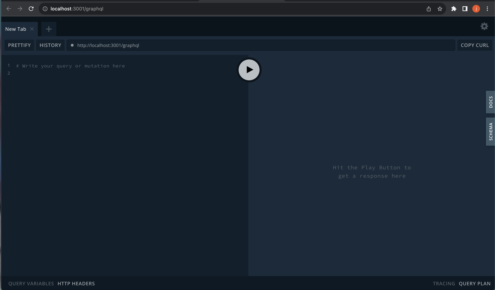

# book-search
A book search application using the MERN stack, with a React front end, MongoDB database, and Node.js/Express.js server and API.

# install

Clone the repository at https://github.com/julianlosak/book-search

run npm i 

run npm start

# screenshots

